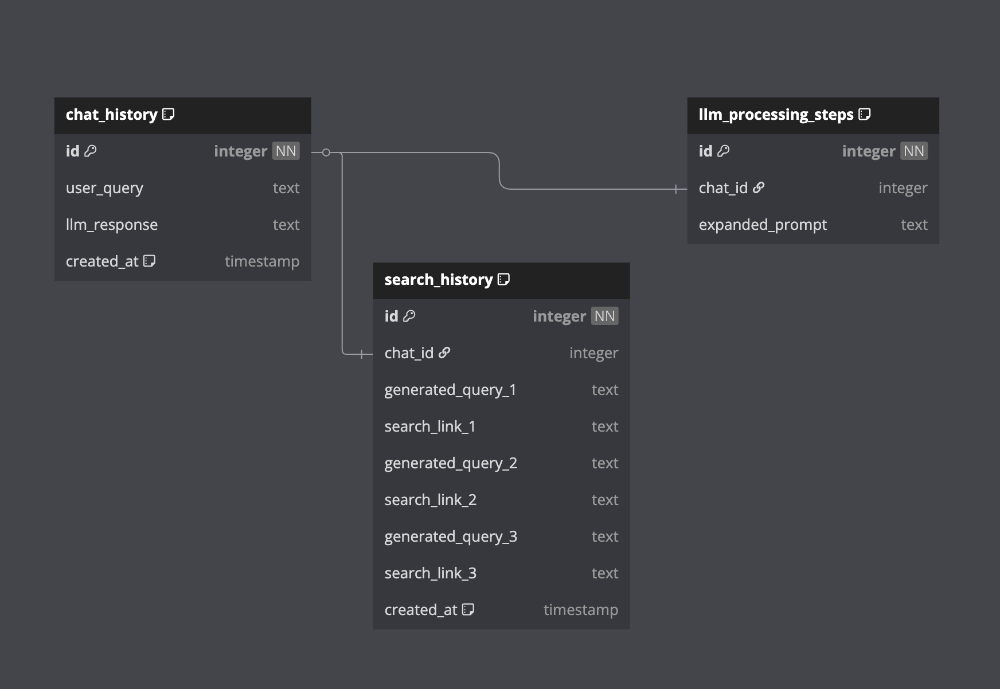

# madeline-task

Task Submission for AI Engineer Role at Madeline & co.


## Overview

This application is a research agent that helps users find answers to complex questions by:

1. Expanding and clarifying the user's question
2. Generating optimal search queries
3. Executing web searches
4. Summarizing the results with proper citations

The agent uses Google's Gemini AI for question expansion and summarization, and Tavily for web searches. All interactions are stored in a PostgreSQL database for future reference.

## Setup

- Clone the repository

```bash
git clone git@github.com:pxndey/madeline-task.git
```

- Install dependencies

```bash
conda create madeline-task python=3.9 -y
conda activate madeline-task
cd madeline-task
pip install -r app/requirements.txt
```

- Specify Environment Variables in the format provided in .env.example

- Run the app and set up the database schema

```bash
docker compose up
docker cp ./data/init_db.sql postgres_db:/tmp/init_db.sql
docker exec -it postgres_db psql -U youruser -d yourdatabase -f /tmp/init_db.sql
```

- Send a POST Request to http://localhost:8000/analyze-competitor to use the Agent

Sample Query

```json
{
    "user_id": "123456789",
    "query": "What is Duolingo's marketing strategy?",
}
```

Sample Response

```json
{
    "respone": {
        "original_question": "Analyze Competitor X's digital strategy",
        "expanded_question": "How does Competitor X use social media?",
        "search_queries": [
            "Competitor X digital marketing",
            "Competitor X SEO",
            "Competitor X PPC"
        ],
        "search_results": [ 
            {"title": "SEO Analysis", "url": "https://example.com/seo", "content": "SEO data", "score": 0.85},
            {"title": "Social Media", "url": "https://example.com/social", "content": "Social insights", "score": 0.78},
            {"title": "PPC Strategy", "url": "https://example.com/ppc", "content": "PPC campaigns", "score": 0.82}
        ],
        "messages": [ 
            {"content": "Competitor X uses aggressive SEO.", "id": "msg_001"}
        ]
    }
}
```


### Database Schema



## Design Decisions and Trade-offs

**Database Schema:**

- **Decision:** Used separate tables for chat history, search history, and processing steps.
- **Trade-off:** More complex queries needed to reconstruct the full conversation.

**Search Limitation:**

- **Decision:** Limited to 3 search queries and 3 results per query.
- **Trade-off:** Reduces API costs but may miss relevant information.


**State Management:**

- **Decision:** Used LangGraph's StateGraph for workflow management.
- **Trade-off:** Adds dependency but provides a clear execution flow.

### Demo Link

[Task Demo](https://youtu.be/j6PC5K5UUFg)